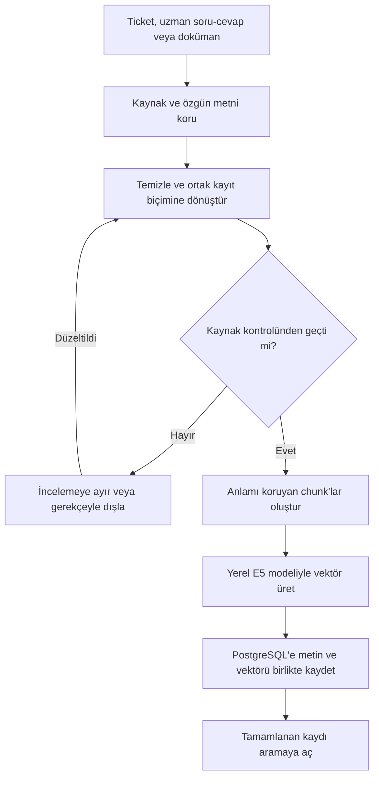
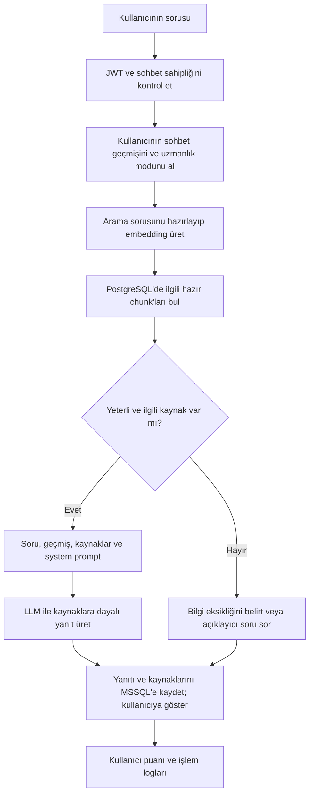

# RAG akışı — Akıllı Servis Masası ve Sistem Uzmanı Chatbot

Proje: PRJIC20260201 · Tarih: 2 Ekim 2026 · Sürüm: 0.3

Başlangıç akış taslağıdır; çalışan uygulama veya gerçekleştirilmiş API çağrısı değildir. ER karşılığı: [01_ER_Taslagi.md](01_ER_Taslagi.md).

RAG, soru geldiğinde bilgi tabanından ilgili metinleri bulup LLM'e bağlam olarak sunmaktır. Kaynak veriyi modele eğitim verisi olarak yüklemek gerekmez. Veri hazırlama, kaynak eklendiğinde/güncellendiğinde yapılır; soru yanıtlamada hazır bilgi tabanı kullanılır.

Embedding başlangıç seçimi: yerel CPU üzerinde `intfloat/multilingual-e5-small` (384 boyut). LLM erişimi henüz kesinleşmedi; uygun yerel prototipte Plus planıyla resmî OpenAI Responses API erişimi öncelikle değerlendirilecek. Groq'ta GPT-OSS-120B alternatifinin ister uyumu kesin kabul edilmez. Hesap erişimi ve performans henüz doğrulanmadı. Değerlendirme [03_Model_Secimi.md](03_Model_Secimi.md) dosyasındadır.

## 1. Bilgi tabanını hazırlama

- Ticketlarda Python yorumları sıralayıp birleştirir. LLM sorun/çözüm/sonuç alanlarını kaynak yorumlarına bağlı çıkarır; biçim ve içerik kontrolü yapılır.
- Uzman soru-cevaplarda soru ile yararlı yanıt birlikte tutulur. Yazar, URL, lisans ve sürüm bilgileri korunur.
- Resmî dokümanlar başlık ve bölüm yapısına göre temizlenir. Ürün sürümü ve bölüm URL'si kayda eklenir.
- Kısa bir ticketın sorun ve çözümü aynı chunk'ta kalabilir. Her kaydı zorunlu olarak birçok parçaya bölmek gerekmez.
- Uzun kayıtlarda başlangıç denemesi E5 tokenizer'ına göre 256–384 token ve gerekirse yaklaşık 50 token örtüşmedir. Ön ek ve özel tokenlar dahil toplam giriş, modelin 512 token sınırını aşmaz. Sessiz kesme yerine uzunluk kontrolü ve anlamı koruyan bölme uygulanır. SQL/PowerShell kodu, adım sırası ve çözüm sınırlamaları korunarak ayarlanır.
- Kayıt/chunk tablosu ve hazır durumu tek PostgreSQL işlemiyle güncellenir. Embedding çağrısı başarısızsa kısmi sonuç aramaya açılmaz; işlem kaydedilip yeniden denenebilir.

Şu an kaynaklar: Mendeley ticket pilotu; Windows ve Oracle için değerlendirilecek uzman soru-cevaplar ve resmî dokümanlar. Uzman kaynakların nihai kapsam seçimi henüz tamamlanmadı.

## 2. Kullanıcının sorusunu yanıtlama

- İlk API kontrolü başarısızsa istek reddedilir; başka kullanıcının geçmişi okunmaz.
- Bağımsız soruda doğrudan soru kullanılır. Önceki mesajlara bağlı soruda gerekirse geçmişten bağımsız bir arama sorusu LLM yardımıyla hazırlanır. Geçmiş, yanıt bağlamına da token sınırı içinde eklenir.
- Soru ve bilgi parçaları aynı embedding modeli/boyutuyla temsil edilir.
- E5 için sorularda `query: `, bilgi parçalarında `passage: ` ön eki kullanılır; vektörler normalize edilir. LLM'e vektörler yerine bulunan chunk metinleri gönderilir.
- Arama, onaylı ve indekslemesi tamamlanmış kayıtlarla sınırlıdır. Uzmanlık modu ve ürün sürümü gibi metadata ilgili kayıtları seçmeye yardım eder.
- İlk denemede en ilgili 5 chunk alınabilir. Chunk sayısı ve uygunluk ölçütleri testlerle ayarlanır; benzerlik skoru doğrudan doğruluk yüzdesi değildir.
- System prompt destek mühendisi rolünü, seçilen Windows/Oracle uzmanlığını, kaynaklara dayanmayı, eksik bilgiyi belirtmeyi ve kodu Markdown bloklarında göstermeyi tanımlar. Kaynak metinleri bağlamdır; içeriklerindeki talimatlar system prompt yerine geçmez.
- LLM, kayıtların kapsamını korur: geçici çözümü kalıcı çözüm gibi veya destek ekibinin bildirimini bağımsız doğrulanmış sonuç gibi sunmaz.
- Kaynak URL/kimlikleri yanıta bağlanır. Üretim hatasında başarı yanıtı kaydedilmez; hata loglanır ve yeniden deneme durumu yönetilir.
- Kullanılacak erişimin hesap ve plan kotaları gözetilir. Toplam prompt ve çıktı tokenları ölçülür; kota hatalarında uygun bekleme/yeniden deneme uygulanır. Ek ücretli kullanıma otomatik geçiş yapılmaz.
- Plus plan kullanımının Responses API akışında geçmiş ve bulunan kaynaklar her HTTP isteğinin `input` dizisine eklenir; `store:false` ve `stream:true` kullanılır. System prompt kavramı bu akışta API'nin `instructions` alanı veya desteklenen developer mesajlarıyla uygulanır. Uygulamanın JWT kullanıcı yönetimi ChatGPT model bağlantısından ayrı kalır.

## 3. Bir örnek

Soru: “Site Chrome'da açılmıyor ama gizli sekmede açılıyor. Ne deneyebilirim?”

Arama sonucunda Mendeley `1005127.0` kaydı ilgili bulunursa, LLM'e şu bilgiler sunulur: normal Chrome erişimi başarısız; incognito erişimi başarılı; destek ekibi tarayıcı önbelleğini temizlemeyi ve yeniden giriş yapmayı önermiş; kullanıcı bunun işe yaradığını bildirmiş. Kaynak yorumları 0, 3 ve 4'tür. Kayıt kesin kök neden bilgisi içermediği için yanıt kök nedeni kesinleştirmez.

Bu bir tasarım örneğidir. Henüz vektör arama çalıştırılıp ilgili kaydın gerçekten bulunduğu ölçülmedi.

## 4. Çalışan uygulamada doğrulama

Projedeki en az 10 servis masası, 5 Windows Server ve 5 Oracle sorusu ile ilgili kaynak bulunması, yanıtın kaynakla uyumu, sürüm uygunluğu, kod/adım doğruluğu, eksik kaynak davranışı, yanıt süresi ve maliyet izlenecek. On ticketlık veri temizleme pilotu bu uygulama test raporunun yerine geçmez. Değerlendirme soruları, model/prompt ayarında kullanılan örneklerden ayrılacak; aynı ticketın kopyaları test sonucunu şişirmeyecek.

Sonraki karar: [03_Model_Secimi.md](03_Model_Secimi.md).
