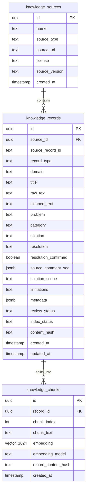
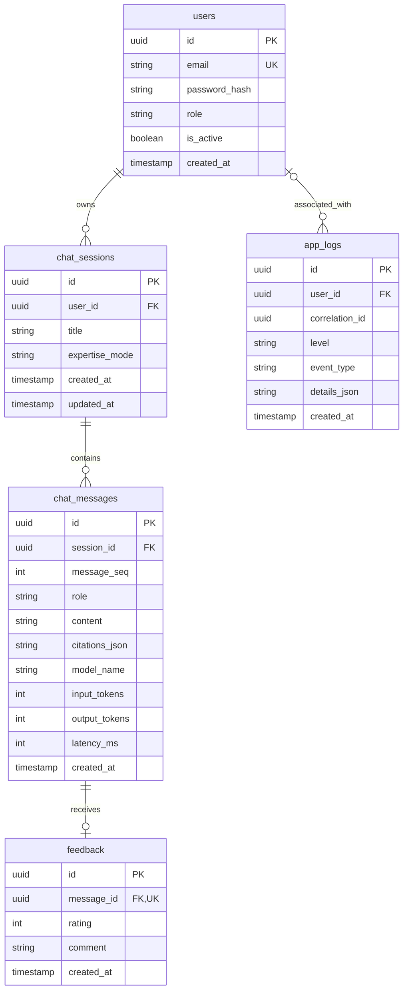

# ER taslağı — Akıllı Servis Masası ve Sistem Uzmanı Chatbot

Proje: PRJIC20260201 · Tarih: 2 Ekim 2026 · Sürüm: 0.5

Bu dosya başlangıç tasarımıdır. Tablolar henüz veritabanlarında oluşturulmadı. Temel, verilen proje belgesi ve Mendeley verisinden hazırlanmış 10 pilot kayıttır.

## 1. ER neyi gösterir?

ER, hangi bilgilerin hangi tablolarda saklanacağını ve tabloların birbirine nasıl bağlanacağını gösterir. PK, satırın kendi benzersiz kimliğidir. FK, aynı veritabanındaki başka bir tablonun kimliğine bağlanan alandır. 1:N ilişkisi, bir kaynağın birçok kaydı olabilmesi gibi bir ilişkidir.

## 2. Veritabanlarının görevleri

| Veritabanı | Bu taslaktaki görev |
|---|---|
| PostgreSQL + pgvector | Kaynaklar, temizlenmiş bilgi kayıtları, chunk metinleri ve embedding vektörleri |
| MSSQL | Kullanıcılar, sohbetler, mesajlar, yanıt puanları ve uygulama logları |

Belge PostgreSQL'i ilişkisel veriler ve vektörler, MSSQL'i kullanıcı yönetimi ve loglar için istiyor. Sohbet geçmişi ve geri bildirimlerin MSSQL'e yerleştirilmesi bu taslağın uygulama tercihidir.

## 3. PostgreSQL ER diyagramı

| Tablo | Amacı | Örnek |
|---|---|---|
| `knowledge_sources` | Verinin geldiği kaynağı tanımlar. | Mendeley Help Desk Tickets v3 |
| `knowledge_records` | Bir ticket, uzman soru-cevap kaydı veya doküman bölümünü saklar. | Chrome'da açılmayan URL hakkında temizlenmiş kayıt |
| `knowledge_chunks` | Aramada kullanılacak metin parçalarını ve onların embedding'lerini saklar. | Sorun + çözüm + sonuç + sınırlamalar içeren bir parça |

### Pilot CSV'nin alanları nereye gidecek?

| Pilot CSV alanı | ER karşılığı |
|---|---|
| `issueid` | `knowledge_records.source_record_id` |
| `problem` | `knowledge_records.problem` |
| `category` | `knowledge_records.category` |
| `solution` | `knowledge_records.solution` |
| `resolution` | `knowledge_records.resolution` |
| `resolution_confirmed` | `knowledge_records.resolution_confirmed` |
| `source_comment_seq` | `knowledge_records.source_comment_seq` |
| `solution_scope` | `knowledge_records.solution_scope` |
| `limitations` | `knowledge_records.limitations` |

`id` bizim ürettiğimiz UUID'dir. `source_record_id`, veri setindeki özgün kimliktir; örneğin `1005127.0` metin olarak korunur. Aynı dış kimlik başka veri setinde de bulunabilir; benzersizlik `(source_id, source_record_id)` ile sağlanır. Bir ticketı ileride ayrı sorun kayıtlarına bölersek bu kural alt kayıt anahtarı eklenerek güncellenir.

Ticket ve soru-cevap kayıtları için sorun/çözüm alanları kullanılır. Resmî doküman bölümlerinde `title` ve `cleaned_text` asıl içeriktir; ticketa özgü alanlar boş olabilir. Dokümana yapay bir ticket çözüm bildirimi eklenmez. `resolution_confirmed` bu yüzden boş/true/false değerlerini destekler; true kaynakta başarı bildirimi olduğunu ifade eder.

`domain`: `general_it`, `windows_server`, `oracle_db`. `record_type`: `ticket`, `qa`, `documentation`. Kategori bu alanlardan ayrıdır; örneğin `Browser / Access`.

`metadata`, kayıt URL'si, yazar/atıf bilgisi, kaynak tarihi, ürün sürümü, dil, çıkarım modeli ve prompt sürümü gibi kaynak türüne göre değişen bilgileri taşır. Ham kaynak dosya ayrıca korunur. `raw_text`, bu kayda karşılık gelen yeniden birleştirilmiş özgün metindir.

`review_status`: `pending`, `approved`, `excluded`. `index_status`: `pending`, `ready`, `error`. Eksik/şüpheli çıkarımlar pending kalır. Başarı bildirimi olmayan bir kayıt, kapsamı ve sınırlamaları açıkça belirtilen yararlı bir teşhis kaydı olarak inceleme sonunda onaylanabilir.

### Temel bütünlük kuralları

- Her kayıt tek bir kaynağa; her chunk tek bir kayda bağlanır.
- `(record_id, chunk_index)` benzersizdir.
- Çalışan pilotta Cloudflare Workers AI üzerindeki `@cf/baai/bge-m3` modeli 1024 boyutlu vektör üretmiştir; fiziksel pgvector alanı `vector(1024)` olacaktır. Aynı aramada tek model ve boyut kullanılacak, model kimliği de kayıtla birlikte saklanacaktır. Model gerekçesi [Model_Secimi.md](Model_Secimi.md) dosyasındadır. RAG yanıtı için `gpt-5.6-terra` erişimi yerel/açık kaynak pilotta doğrulanmıştır.
- Metin ve embedding aynı chunk satırında tutulur. Sadece `review_status=approved` ve `index_status=ready` olan kayıtlar aramaya alınır.
- İçerik değiştiğinde yeniden indeksleme pending'e alınır. Yeni embedding'ler hazırlandıktan sonra chunk değişimi ve ready durumu PostgreSQL işlemi içinde birlikte kaydedilir. Başarısız işlemde eksik bir chunk grubu aramaya açılmaz.
- Model değiştiğinde aynı boyutta olsa bile eski ve yeni modellerin vektörleri aynı aramada karıştırılmaz; ilgili indeks yeniden üretilir.

## 4. MSSQL ER diyagramı

Bu diyagramdaki tipler kavramsaldır. MSSQL uygulamasında UUID için `uniqueidentifier`, uzun metin için `nvarchar(max)`, tarih için `datetime2`, boolean için `bit` gibi fiziksel tipler seçilecek.

| Tablo | Amacı |
|---|---|
| `users` | Kayıt/giriş, kullanıcı ve admin rolü |
| `chat_sessions` | Kullanıcıya ait sohbet ve seçilen uzmanlık modu |
| `chat_messages` | Sıralı kullanıcı/bot mesajları, kullanılan kaynaklar ve model ölçümleri |
| `feedback` | Bot yanıtına verilen 1–5 puan ve isteğe bağlı yorum |
| `app_logs` | Giriş, veri yükleme, yanıt üretme veya hata gibi uygulama olayları |

### Temel kurallar

- Email normalize edilir ve benzersiz tutulur. Parola metni saklanmaz; seçilecek parola karma yönteminin salt/parametreleri içeren kodlanmış çıktısı `password_hash` alanında saklanır. Kriptografik yöntem uygulama aşamasında seçilir.
- `users.role`: `user`, `admin`. `chat_sessions.expertise_mode`: `service_desk`, `windows_server`, `oracle_db`. `chat_messages.role`: `user`, `assistant`.
- Mesaj sırası için `(session_id, message_seq)` benzersizdir. JWT'deki kullanıcı kimliği ile sohbet sahibinin eşitliği her sohbet okuma/yazma işleminde kontrol edilir.
- Puan 1–5 arasındadır. Yalnızca assistant mesajı ve ilgili sohbetin sahibi için puan kabul edilir. Mesaj başına en fazla bir puan vardır; kullanıcı kendi puanını güncelleyebilir.
- Anonim/giriş öncesi olaylar için `app_logs.user_id` boş olabilir. Log ayrıntıları olay bilgisi içerir; parola, JWT ve API anahtarı yazılmaz.
- Yanıtın `citations_json` alanı, kullanılan PostgreSQL chunk/kayıt kimliklerini, sürüm/hash bilgisini, kaynak adı/URL'sini ve kısa kaynak gösterim bilgisini saklar. Bu, iki veritabanı arasında FK olarak tanımlanmaz; bağlantıyı uygulama yönetir.
- Silinen/güncellenen bilgi kayıtlarının eski mesaj kaynakları izlenebilir kalması için kaynak adı/URL ve içerik sürümü yanıtla birlikte korunur. Gerekirse kaynak kayıtlar fiziksel silme yerine aramadan çıkarılır.

## 5. Gereksinimlerle eşleme

| Proje gereksinimi | Karşılık |
|---|---|
| Temiz açıklama ve çözüm | `knowledge_records` |
| Chunk + embedding + vektör arama | `knowledge_chunks` |
| Kaynak, atıf ve ürün sürümü | `knowledge_sources` + kayıt `metadata` alanı |
| Windows/Oracle modu | Kayıt `domain` alanı + sohbet `expertise_mode` alanı |
| Kullanıcı kayıt/giriş ve yetkilendirme | `users` + API/JWT kontrolü |
| Sohbet geçmişi ve önceki mesajlar | `chat_sessions` + `chat_messages` |
| Yanıt puanlama | `feedback` |
| Admin raporları ve loglama | Mesajlar + puanlar + `app_logs` |

Admin panelinde puanların özeti kullanıcı geri bildirimi olarak gösterilir. Örneğin olumlu puan oranı, puan veren kullanıcılar arasındaki orandır; tek başına teknik doğruluk oranı veya sorunun çözüldüğü anlamına gelmez. Teknik başarı ayrıca proje test raporuyla ölçülecek.

## 6. Şu anki örneğin yerleşimi

Mendeley için bir `knowledge_sources` satırı açılır. `1005127.0` için bir `knowledge_records` satırı oluşturulur. Sorun, kategori, çözüm, sonuç ve kaynak yorumları mevcut pilot kayıttan alınır. Kontrol edilen kısa kayıt bir chunk olarak hazırlanabilir; uzunluk ve içerik gerektirirse birden fazla chunk oluşturulur. 10 pilot kaydın embedding'leri BGE-M3 ile üretilmiş ve bellekte arama doğrulanmıştır. PostgreSQL bağlantısı henüz kurulmadığından bu başarı veritabanındaki `index_status=ready` durumunu temsil etmez.

Sonraki tasarım: [RAG_Akisi.md](RAG_Akisi.md).
