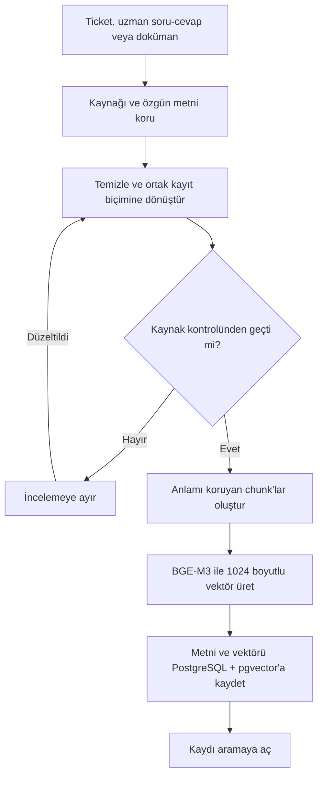
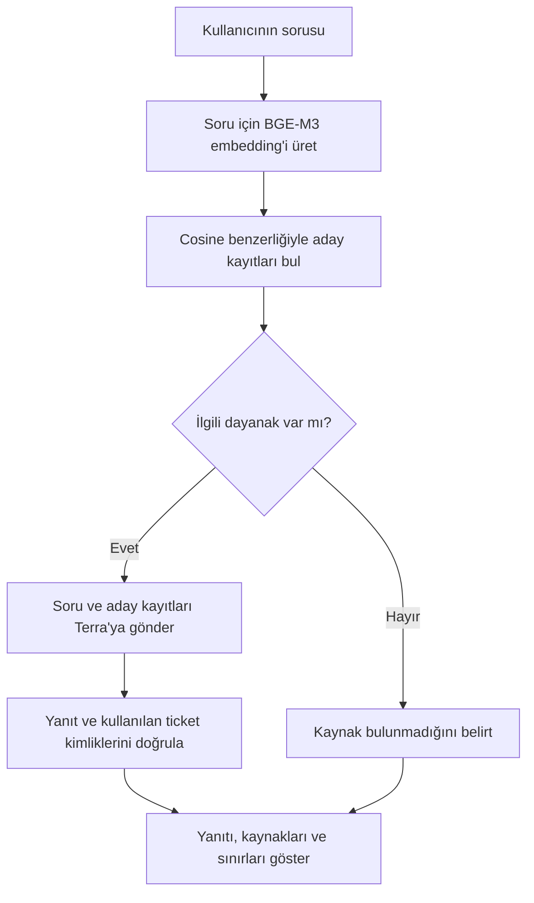

# RAG akışı — Akıllı Servis Masası ve Sistem Uzmanı Chatbot

Proje: PRJIC20260201 · Tarih: 2 Ekim 2026 · Sürüm: 0.4

Bu belge tasarlanan üretim akışını ve 10 ticket ile çalışan pilotu birlikte gösterir. ER karşılığı: [ER_Taslagi.md](ER_Taslagi.md). Model gerekçeleri: [Model_Secimi.md](Model_Secimi.md).

RAG, kullanıcının sorusuna benzeyen bilgi kayıtlarını bulup bu kayıtları LLM'e bağlam olarak vermektir. Kaynak veriye model eğitimi uygulanmaz. Pilot; Cloudflare Workers AI üzerindeki `@cf/baai/bge-m3` embedding modeli ile OpenAI Responses API üzerindeki `gpt-5.6-terra` modelini kullanır.

## 1. Bilgi tabanını hazırlama

- Ticket yorumlarından `problem`, `solution`, `resolution`, `resolution_confirmed`, `source_comment_seq`, `solution_scope` ve `limitations` alanları çıkarılır; kaynak yorumlarla karşılaştırılır.
- Kısa ticketlarda sorun ve çözüm aynı chunk'ta kalabilir. Pilotun 10 kısa kaydında aranan metin `Problem + Solution` birleşimidir; diğer alanlar yanıt üretiminde kaynak bağlamına eklenir.
- Uzun ticket ve dokümanlarda chunk boyutu deneyle belirlenecek. SQL/PowerShell kodları, işlem sırası ve çözüm sınırlamaları bölme sırasında korunacak.
- Embedding çağrısı başarısızsa eksik kayıt aramaya açılmaz. Model adı, boyut, içerik özeti ve kaynak sürümü saklanır.
- Pilot vektörleri `outputs_local/ticket_vektorleri.json` içinde tutulur. Üretim aşamasında aynı görev PostgreSQL + pgvector'a taşınacaktır.

## 2. Kullanıcının sorusunu yanıtlama

- Soru ve bilgi kayıtları aynı embedding modeli ve 1024 boyutla temsil edilir. Vektörler normalize edilir; cosine benzerliği yalnızca sıralama değeridir, doğruluk yüzdesi değildir.
- Pilot en yakın üç kaydı Terra'ya gönderir. Model yalnızca soruyla ilgili kayıtları kullanır; adayların tümünü kullanmak zorunda değildir.
- Ticket metinleri veri olarak ele alınır. İçlerindeki talimatlar uygulamanın yönergelerini değiştiremez.
- `resolution_confirmed=false` olan sonuç müşteri onayı gibi sunulmaz. `workaround`, kalıcı çözüm olarak; `diagnostic_approach`, eksiksiz uygulama tarifi olarak anlatılmaz.
- Kaynakta bulunmayan SQL komutu, cache değeri, dosya yolu, port, sürüm veya yapılandırma anahtarı üretilmez.
- Model çıktısı tamamlanmış `response.completed` olayı gelmeden başarı sayılmaz. Yanıtta kullanılan ticket kimliklerinin adaylar arasında olduğu ayrıca kontrol edilir.
- Yerel pilotta OpenAI isteği `store:false`, `stream:true` ve `instructions` alanıyla gönderilir. ChatGPT ve Cloudflare kimlik bilgileri Git deposunun dışında tutulur.
- Üretim sürümünde JWT, sohbet sahipliği, MSSQL geçmişi ve pgvector filtreleri bu akışın çevresine eklenecektir.

## 3. Çalışan pilotun sonuçları

10 kayıtlık pilotta üç olumlu arama ve bir kapsam dışı soru elle kontrol edildi:

| Soru türü | İlk sonuç | Gözlem |
|---|---:|---|
| Chrome normal pencerede açılmıyor, gizli pencerede açılıyor | `1005127.0` | Önbellek temizleme yaklaşımı, müşteri onayı ve kök neden sınırlaması korundu. |
| Yük dengeleyicide HTTP/HTTPS karışıklığı | `1007295.0` | İlgili teşhis yaklaşımı ilk sırada bulundu. |
| Oracle sequence nedeniyle toplu işlem yavaşlığı | `1010047.0` | Ayrı müşteri doğrulaması olmadığı ve SQL/cache değerlerinin eksik olduğu belirtildi. |
| Domates çorbası tarifi | İlgili kaynak yok | Model teknik çözüm uydurmadı ve aday ticketların konu dışı olduğunu söyledi. |

Bu sonuçlar küçük bir işlev doğrulamasıdır. Genel arama doğruluğu veya üretim kalitesi sonucu olarak kullanılamaz.

## 4. Sonraki doğrulamalar

1. Uzun kayıtlar için chunk stratejisini belirlemek.
2. PostgreSQL ve pgvector bağlantısını kurup `vector(1024)` alanında aynı aramayı tekrarlamak.
3. En az 10 servis masası, 5 Windows Server ve 5 Oracle sorusundan ayrı bir değerlendirme seti hazırlamak.
4. `Recall@k` veya ilk sıralarda doğru kaynak bulunma oranı ile yanıtın kaynak uyumunu ayrı ölçmek.
5. Yanıt süresi, kota hataları, eksik kaynak davranışı ve kullanıcı geri bildirimini kaydetmek.

## 5. Kaynaklar

- [Cloudflare BGE-M3 model sayfası](https://developers.cloudflare.com/workers-ai/models/bge-m3/)
- [Cloudflare OpenAI uyumlu embeddings uçları](https://developers.cloudflare.com/workers-ai/configuration/open-ai-compatibility/)
- [OpenAI model kataloğu ve Responses API akışı](https://developers.openai.com/siwc/token-sharing-open-source/models-and-inference)
- [OpenAI önizleme sınırlamaları](https://developers.openai.com/siwc/token-sharing-open-source/preview-limitations)

